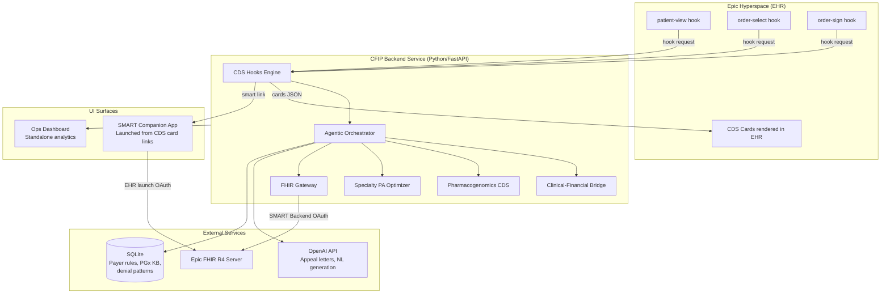
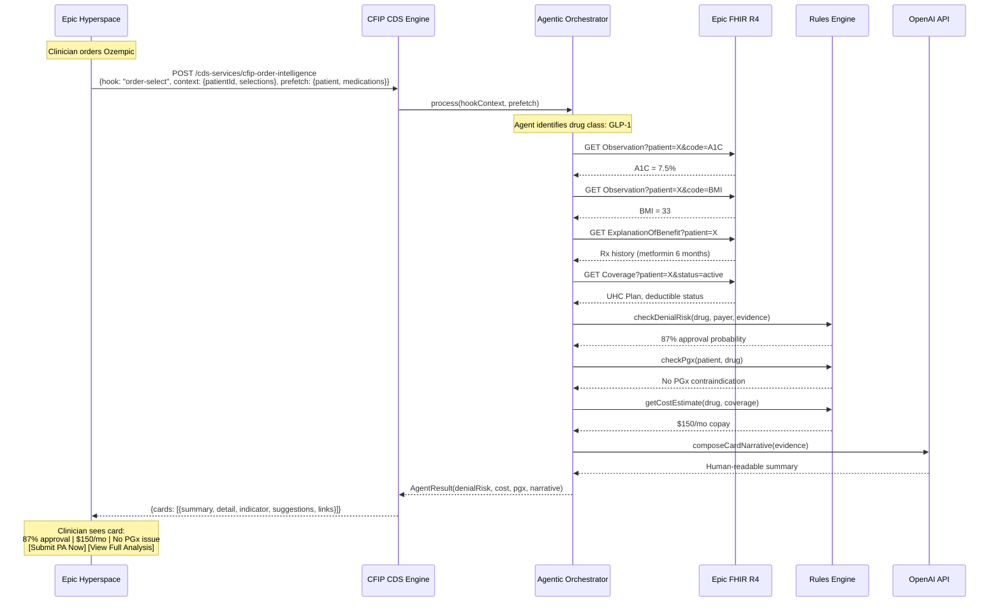
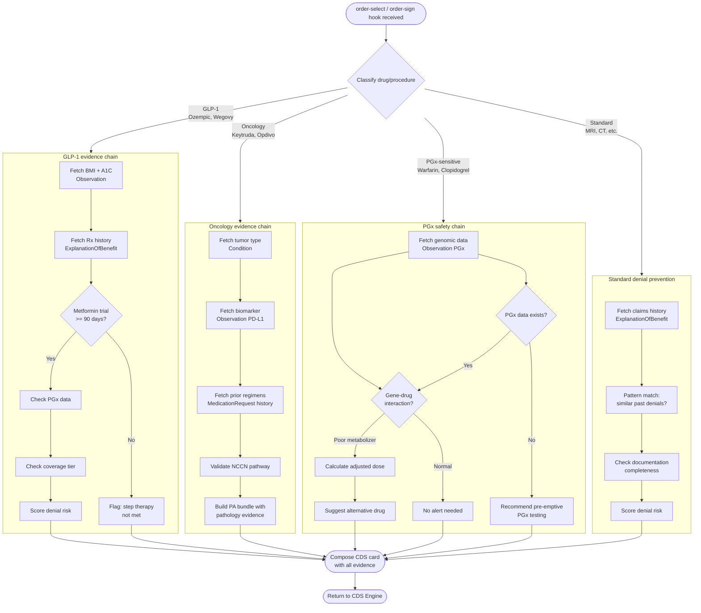
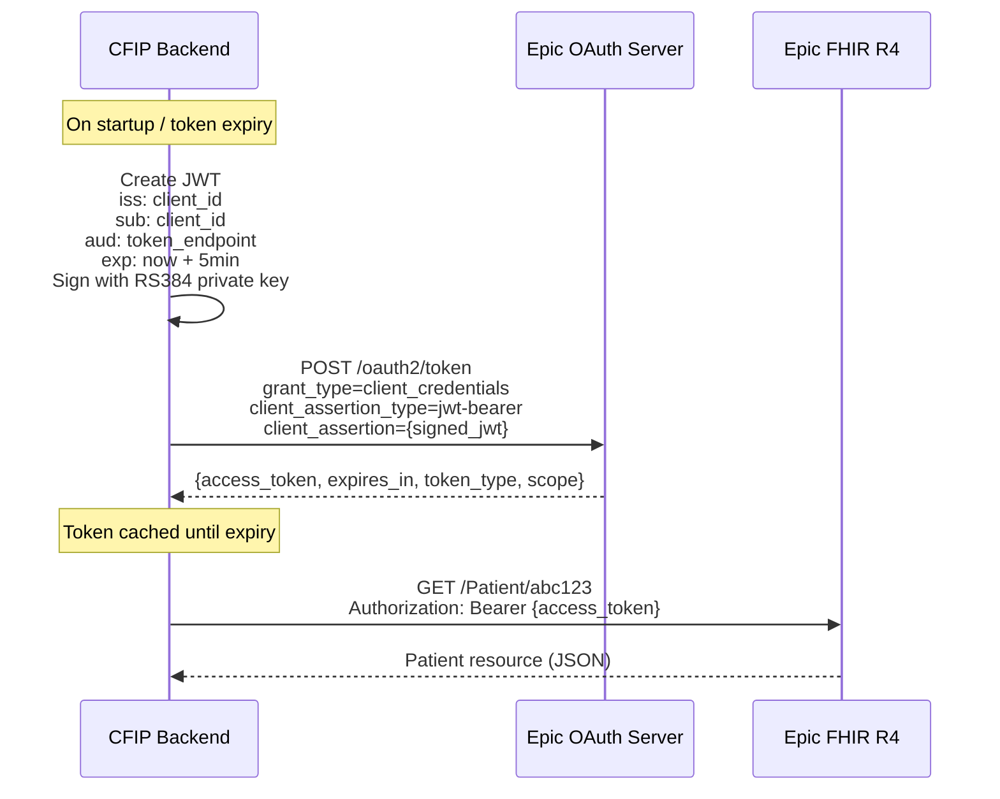
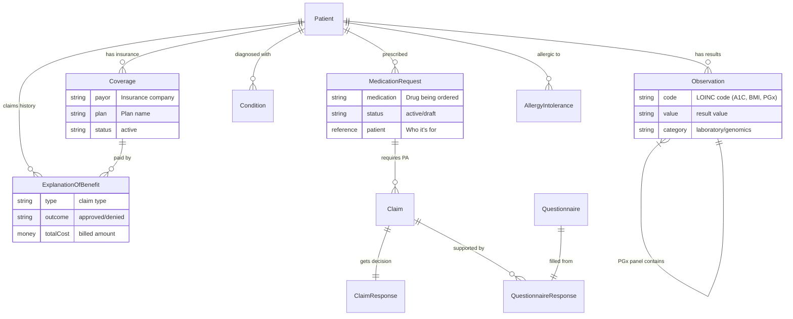
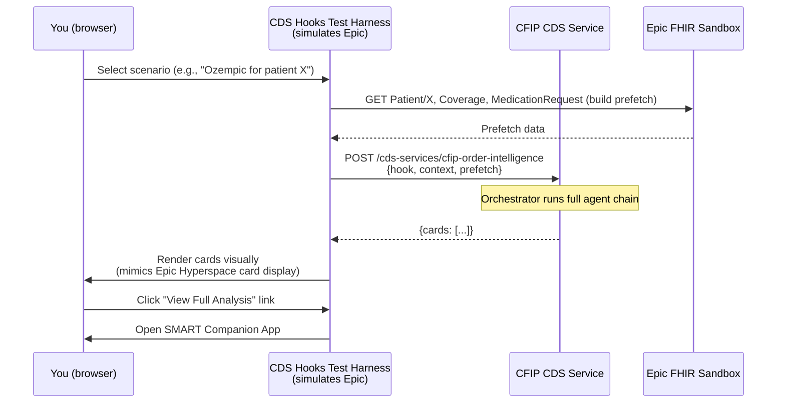

## ctrl+shift+v is the shortcut
# CFIP — Architecture Diagrams

> This document is the visual companion to `requirement.md`.
> Both documents must be provided at the start of every session.

---

## 1. System Context — Three UI Surfaces, One Backend



---

## 2. CDS Hooks Request/Response Flow



---

## 3. Agentic Orchestration — Decision Tree

This shows how the orchestrator dynamically selects different evidence chains based on drug class.



---

## 4. SMART Backend Services OAuth Flow



---

## 5. Solution Structure

```
CFIP/
├── app/
│   ├── main.py                     # FastAPI entry point
│   ├── config.py                   # Settings, Epic sandbox config
│   │
│   ├── api/
│   │   ├── cds_hooks.py            # GET /cds-services, POST /cds-services/{id}
│   │   ├── smart_launch.py         # SMART companion app launch handler
│   │   └── dashboard.py            # Ops dashboard API endpoints
│   │
│   ├── fhir/
│   │   ├── client.py               # Epic FHIR R4 client (httpx + fhirclient)
│   │   ├── auth.py                 # SMART Backend Services OAuth (JWT + token mgmt)
│   │   └── resource_mappers.py     # FHIR resource → domain model converters
│   │
│   ├── agents/
│   │   ├── orchestrator.py         # Main agentic orchestrator (plan-execute-verify)
│   │   ├── denial_prediction.py    # Clinical-financial bridge agent
│   │   ├── pgx_safety.py           # Pharmacogenomics CDS agent
│   │   └── specialty_pa.py         # Specialty drug PA agent
│   │
│   ├── rules/
│   │   ├── cpic_engine.py          # Deterministic PGx rules (CPIC guidelines)
│   │   ├── payer_rules.py          # Payer-specific PA requirements
│   │   ├── denial_scorer.py        # Denial risk scoring (weighted criteria)
│   │   └── drug_classifier.py      # Drug class identification (GLP-1, onco, PGx, standard)
│   │
│   ├── intelligence/
│   │   ├── openai_client.py        # OpenAI API wrapper
│   │   ├── appeal_generator.py     # Auto-appeal letter generation
│   │   └── card_composer.py        # CDS card narrative composition
│   │
│   ├── models/
│   │   ├── cds_hooks.py            # CDS Hooks request/response models (Pydantic)
│   │   ├── domain.py               # Domain models (DenialRisk, PgxResult, etc.)
│   │   └── fhir_types.py           # Thin wrappers over FHIR resource types
│   │
│   └── data/
│       ├── db.py                   # SQLite connection + queries
│       ├── seed_payer_rules.py     # Seed payer-specific rules
│       ├── seed_cpic.py            # Seed CPIC drug-gene pairs
│       └── seed_synthetic.py       # Seed demo scenario data
│
├── tests/
│   ├── test_auth.py
│   ├── test_cds_hooks.py
│   ├── test_orchestrator.py
│   ├── test_denial_scorer.py
│   └── test_pgx_engine.py
│
├── tools/
│   └── cds_hooks_harness/          # Test harness simulating Epic hook calls
│       ├── harness.py              # Fires synthetic hook events at CFIP
│       └── scenarios.py            # Demo scenario definitions (A, B, C, D)
│
├── keys/
│   ├── private_key.pem             # RS384 private key (gitignored)
│   └── public_key.pem              # RS384 public key (uploaded to Epic)
│
├── requirements.txt
├── pyproject.toml
├── .env                            # Epic client_id, OpenAI API key (gitignored)
└── README.md
```

---

## 6. FHIR Resource Relationships

Shows how FHIR resources connect to each other in CFIP's data model.



---

## 7. CDS Hooks Test Harness Architecture

Since Epic sandbox doesn't support CDS Hooks directly, we build our own test harness.



---

## 8. Deployment View (Dev Environment)

```
Your Windows Laptop (8GB RAM)
├── Python 3.12 runtime (~50MB)
├── CFIP FastAPI server (localhost:8000) (~100MB)
│   ├── CDS Hooks endpoints
│   ├── SMART companion app (served static)
│   └── Dashboard API
├── SQLite database (~5MB)
├── VS Code (~500MB)
└── Browser
    ├── CDS Hooks test harness UI
    ├── SMART companion app
    └── Ops dashboard

External (no local resources):
├── Epic FHIR Sandbox (fhir.epic.com)
└── OpenAI API (api.openai.com)

Estimated total RAM: ~800MB-1.2GB
Remaining for OS: ~6.5GB+
```

---

## Diagram Index

For quick reference in sessions:

| # | Diagram | Section | Shows |
|---|---------|---------|-------|
| 1 | System context | §1 | All components + three UI surfaces + external services |
| 2 | CDS Hooks flow | §2 | Full order-select sequence with Epic + agent + FHIR calls |
| 3 | Agentic decision tree | §3 | How orchestrator picks different chains per drug class |
| 4 | OAuth flow | §4 | SMART Backend Services JWT auth with Epic |
| 5 | Solution structure | §5 | Python project file/folder layout |
| 6 | FHIR relationships | §6 | How FHIR resources connect in CFIP's data model |
| 7 | Test harness | §7 | How we simulate CDS Hooks without Epic Hyperspace |
| 8 | Deployment view | §8 | What runs where on your 8GB Windows machine |
